[Home](../../) > [Manuals](../) > [Installation guide](./) > OpenCV install - Windows

<div class="title">OpenCV install - Windows</div>

If you already have OpenCV installed you are now ready to install [SportsReview](sportsreview-win.html) install

<div class="toc"><ul>
<li><a href="#numpy">NumPy</a></li>
<li><a href="#opencv">OpenCV</a></li>
</ul></div>

# NumPy

OpenCV requires NumPy so we will install it first

1. Download the latest version of NumPy: [http://www.lfd.uci.edu/~gohlke/pythonlibs/#numpy](http://www.lfd.uci.edu/~gohlke/pythonlibs/#numpy)
	* Note: this is an unofficial source; the official one only has 32-bit binary version

2. Windows will suggest it is a *security* issue.  Click **Run** anyway
<br/><br/>

3. Click **Next >**
<br/><br/>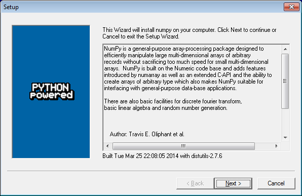

4. Select the correct (Python 2.7) from top list the click **Next >**
<br/><br/>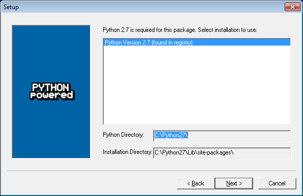

4. Click **Next >** and it will install
<br/><br/>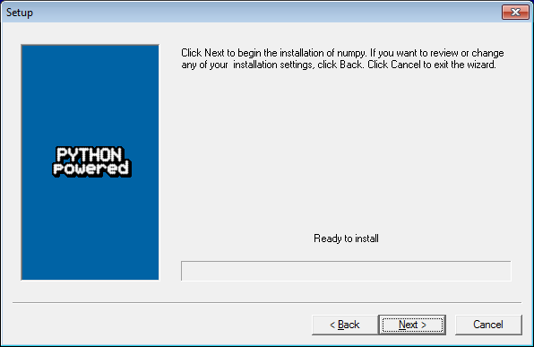

5. Click **Finish** and you are done with NumPy
<br/><br/>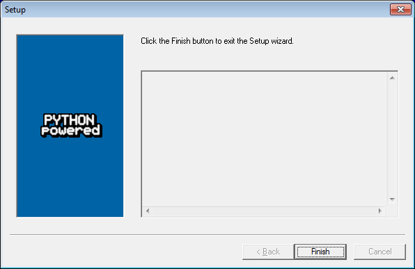

# OpenCV

Now back to installing OpenCV

1. Download the OpenCV installer: [http://sourceforge.net/projects/opencvlibrary/files/opencv-win/](http://sourceforge.net/projects/opencvlibrary/files/opencv-win/)
	* Get the latest stable release (usually just numbers in its name)

2. Run the program you downloaded
3. Windows will suggest it is a *security* issue.  Click **Run** anyway
<br/><br/>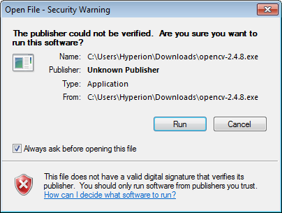

4. Alter the **Extract to** value to read just **C:\\**
5. Click **Extract**
<br/><br/>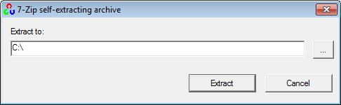

6. A progress dialog will appear and take several minutes to install
<br/><br/>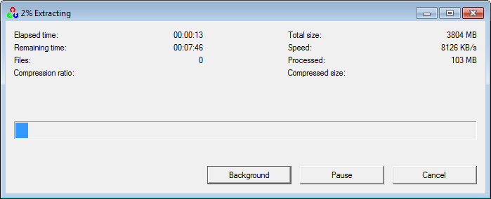

7. *NOTE*: When the extraction is finished the progress bar will close

8. Type **cmd** into your **windows** menu.  
9. Right-click on **cmd.exe** and select **Run as administrator** on the popup menu
<br/><br/>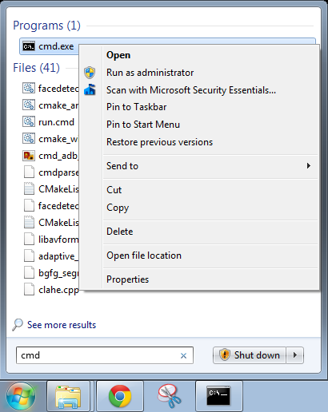

10. Click **Yes** to allow the program to start
<br/><br/>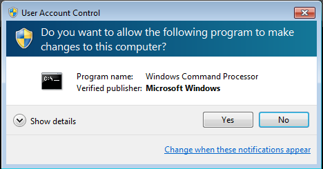

11. In the dialog type the following two commands:
	* ```setx -m PATH "%OPENCV_DIR%\bin;%PATH%"```
	* ```setx -m OPENCV_DIR c:\opencv\build\x64\vc11```
12. NOTE: they must be in the order presented otherwise you might have trouble upgrading in the future
13. It should show *SUCCESS: Specified value was saved.* between each
<br/><br/>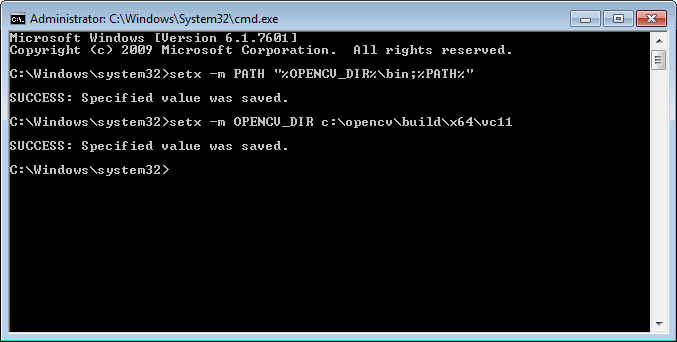

14. Close the cmd.exe program

15. Type **win** into your **windows** menu
16. Click **Windows Explorer**
<br/><br/>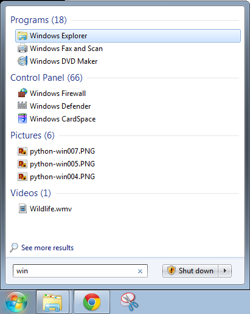

17. Browse to the **C:\\opencv\\build\\python\\2.7\\x64**
18. Copy the **cv2.pyd** file
<br/><br/>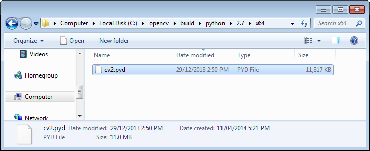

19. Browse to the **C:\\Python27\\Lib\\site-packages** directory
20. Paste the file into this directory
<br/><br/>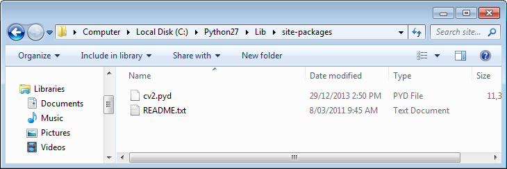

---
Next up is: [SportsReview install](sportsreview-win.html)