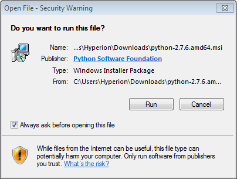
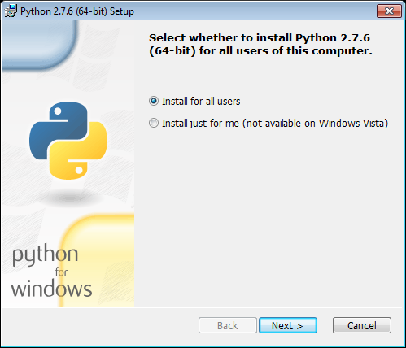
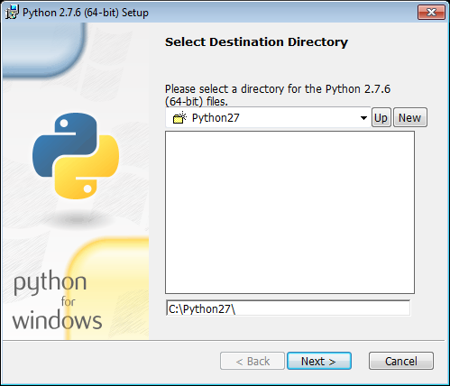
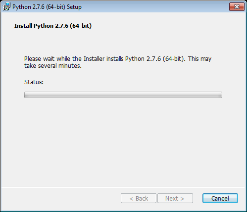
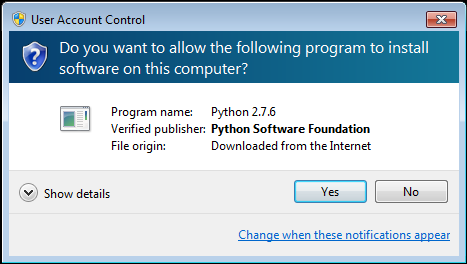
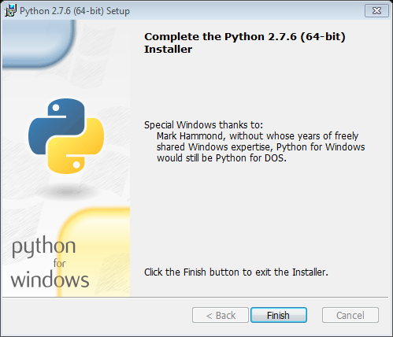

[Home](../../) > [Manuals](../) > [Installation guide](./) > Python install - Windows

Python install - Windows

If you have already installed Python, proceed to [PySide](pyside-win.html) (or [PyQt4](pyqt4-win.html))

1. Download Python installed from: [https://www.python.org/download/](https://www.python.org/download/)
	* at this point we recommend using Python 2.7.6.
	* you will probably want the *Python 2.7.6 Windows X86-64 Installer*

2. Start the installer program (which is likely called *python-2.7.6.amd64.msi*)

3. Windows *may* decide this is a security risk.  Click **Run**
  

4. Choose where you want Python to install and click **Next >** (either option is fine)
  

5. Choose which directory to install Python and click **Next >** (default is fine unless you don't have 
a C:)
  

6. Choose the features and click **Next >** (leave all selected to be safe)
  

7. Windows will now install Python which might take a while.  Note: see next screen
  

8. Windows may ask you to confirm you want to install it.  Click **Yes** (Note: this may come up behind 
other windows so you may need to look for it)
  

9. After its finished the following screen will show.  Click **Finish** and you are done.
  

---
Next up is: [PySide](pyside-win.html) (or [PyQt4](pyqt4-win.html))

